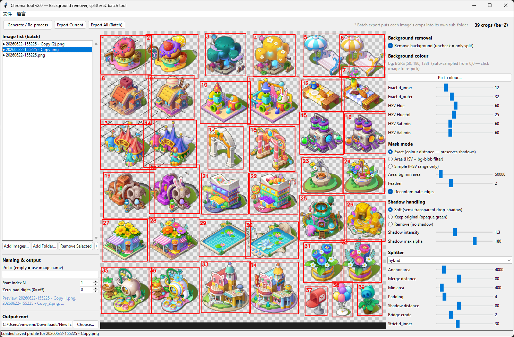

# Chroma Tool 中文文档

> **English:** [README.md](README.md)  ·  **中文:** README.zh.md  ·  **日本語:** [README.ja.md](README.ja.md)



> **色键抠图 + 精灵图自动切割 + 批量处理工具。**
> Python 编写,同时提供 Tkinter 图形界面和命令行。输入纯色背景图
> (绿幕拍摄、精灵图集 sprite sheet、纯色底图标网格等),自动去除背景
> 并保留阴影/同色细节,然后把每个前景对象切成独立的透明 PNG。

**主题词 / 关键词:**
色键抠图 · 抠图工具 · 绿幕去背景 · 绿屏抠图 · 自动抠图 ·
精灵图切割 · 雪碧图切割 · sprite sheet 切割 · 图标网格分割 ·
图标提取 · 批量抠图 · 批量处理 · 透明 PNG · RGBA 输出 ·
前景提取 · alpha 通道 · 阴影保留 · 投影保留 · 软阴影 ·
卡通精灵图 · 游戏美术管线 · Python · OpenCV · Tkinter ·
图形界面 · 命令行 · 离线工具 · 不依赖大模型。

## 目录

1. [它能做什么](#它能做什么)
2. [核心特性](#核心特性)
3. [适用场景](#适用场景)
4. [安装](#安装)
5. [GUI 快速上手](#gui-快速上手)
6. [命令行快速上手](#命令行快速上手)
7. [输出目录结构](#输出目录结构)
8. [命名规则](#命名规则)
9. [抠图模式](#抠图模式)
10. [切割策略](#切割策略)
11. [阴影处理](#阴影处理)
12. [调参速查表](#调参速查表)
13. [项目架构](#项目架构)
14. [常见问题 FAQ](#常见问题-faq)
15. [已知限制](#已知限制)

## 它能做什么

Chroma Tool 接收一张或多张**纯色背景**的图片 ——
例如绿幕拍摄的精灵图、纯色底的图标网格、色键合成的产品图 ——
然后产生:

* 一张**逐像素的 alpha 蒙版**,把前景从背景中分离出来,
  同时保留阴影和与背景同色调的内部细节(例如叶片、装饰、投影);
* 一组**带透明背景的 PNG 切割图**,每个精灵一张。

在**批量模式**下,同一套参数会被一次性应用到多张输入图,每张图的
切割结果会被写入以该图文件名命名的子文件夹。

这是一个纯计算机视觉工具 —— 不依赖大模型、不联网、不上传任何数据,
所有处理都在本地基于 OpenCV 和 NumPy 完成。

## 核心特性

1. **批量处理。** 在 GUI 里加入几十张图,在一张预览图上调好参数,
   然后一键用同一套参数导出所有图。
2. **自定义命名。** 可设置前缀、起始序号、补零位数。前缀留空时默认
   使用输入文件名,序号格式如 `myimage_1.png`、`myimage_2.png` ……
3. **每张图独立子文件夹。** 批量导出时,每张输入图的切割结果会被
   放进以该图文件名命名的子目录,杜绝同名文件互相覆盖。
4. **阴影保留的抠图算法。** 内部维护"严格"和"宽松"两套 alpha,
   通过 OpenCV 的距离变换把阴影像素归属给最近的图标主体,
   避免阴影被一刀切掉或飘到隔壁图标头上。
5. **软投影重投。** 阴影像素可以从"不透明背景色"转换为
   "半透明黑色",在合成到任何新背景上时都能形成自然的投影。
6. **三种切割策略:** hybrid(连通域 + 主图标吸收碎片)、
   grid(固定网格)、contour(外轮廓)。
7. **三种抠图模式:** exact(BGR 距离)、area(HSV + 大块连通域)、
   simple(纯 HSV 范围)。
8. **不再生成 `_preview.png`。** 预览只在 GUI 画布中显示,
   输出目录只包含真正的切割图(单图导出时可选额外生成
   `_transparent.png`)。
9. **中英日三语界面**,运行时可切换,默认英文。
10. **设置自动持久化**,以 JSON 形式保存到
    `%APPDATA%\ChromaTool\settings.json` (Windows) 或
    `~/.config/chromatool/settings.json` (Linux/macOS)。

## 适用场景

* 有一张**精灵图集 (sprite sheet)**,底色统一,想把每个精灵
  切成独立的透明 PNG。
* 有一批**绿幕/蓝幕拍摄**的产品/角色图,需要批量去背景。
* 在做**游戏美术管线**,希望有一个可脚本化、可放进 CI 的
  自动抠图工具。
* 有一张**设计稿里的图标网格**,想把每个图标导出成单独文件。
* 想要一个**可视化工具**来反复试参数,调好后一键应用到整个文件夹。

不适合用本工具处理:

* 头发、毛发、运动模糊等**软边缘**主体 —— 这类需要 alpha
  matting,可在本工具的 alpha 基础上再用
  [PyMatting](https://github.com/pymatting/pymatting) 二次处理。
* **多色背景**或**真实摄影背景** —— 本工具一次只处理一种背景色。
* **互相接触/重叠**且共享前景像素的精灵 —— 连通域切割无法把它们
  分开,只能改用网格切割或先手动分离。

## 安装

```bash
pip install -r requirements.txt
```

依赖:`opencv-python`、`numpy`、`Pillow`。需要 Python 3.10 或更高。

## GUI 快速上手

```bash
python gui.py
```

1. **文件 → 添加图像**(或 **添加整个文件夹**)往左侧图像列表里
   加图。
2. 点击列表中的某项,它就成为当前预览图。
3. 在右侧调整参数,点击 **生成 / 重新处理** 重新计算。
4. 在左下的"命名与输出"面板中设置 **前缀**、**起始序号 N**、
   **补零位数** —— 下方的预览会实时显示前两个输出文件名。
5. 选择 **输出根目录**。
6. 点击 **批量导出全部**,当前参数会被应用到列表中的每一张图,
   每张图的切割结果会写入以图名命名的子文件夹。

快捷键:`Ctrl+O` 添加图像 / `Ctrl+E` 导出当前图 / `Ctrl+B` 批量导出。

## 命令行快速上手

单图:

```bash
# 默认从像素 (0,0) 取背景色,使用 hybrid 切割
python cli.py process input.png out_dir

# 指定取色像素
python cli.py process input.png out_dir --pick 5 5

# 直接指定背景 BGR 色
python cli.py process input.png out_dir --bg 50 180 138

# 自定义命名:hero_000.png, hero_001.png …
python cli.py process input.png out_dir \
    --name-prefix hero --name-start 0 --name-pad 3

# 固定网格切割
python cli.py process sheet.png out --split grid --cell-w 200 --cell-h 200
```

批量(每张输入图自动建子文件夹放进 `--out-root`):

```bash
python cli.py batch --out-root output/ a.png b.png c.png
python cli.py batch --out-root output/ ./sprites_folder/
python cli.py batch --out-root output/ ./sprites/ \
    --name-prefix icon --name-pad 3
```

完整参数请运行 `python cli.py process --help` 或
`python cli.py batch --help`。短格式 `python cli.py IN OUT …`(不带
子命令)也会被自动识别为 `process`。

## 输出目录结构

单图导出会把所有结果放进你选的输出目录:

```
out_dir/
├── _transparent.png       完整抠图结果(RGBA,可选)
├── myimage_1.png
├── myimage_2.png
└── …
```

批量导出会为每张输入图建立一个子文件夹:

```
out_root/
├── myimage/
│   ├── myimage_1.png
│   ├── myimage_2.png
│   └── …
├── another/
│   ├── another_1.png
│   └── …
└── …
```

**任何模式下都不会再生成 `_preview.png`。** 预览框只在 GUI 画布上
显示,不会被写到磁盘。

## 命名规则

前缀留空时,自动使用输入图文件名(去掉扩展名)。序号从设定的
起始值开始,可选零填充。

| 前缀    | 起始 | 补零 | 前三个文件名                                         |
|--------|----:|----:|-----------------------------------------------------|
| 留空   |   1 |   0 | `myimage_1.png`, `myimage_2.png`, `myimage_3.png`   |
| 留空   |   0 |   3 | `myimage_000.png`, `myimage_001.png`, `myimage_002.png` |
| `hero` |   1 |   2 | `hero_01.png`, `hero_02.png`, `hero_03.png`         |

## 抠图模式

| 模式 | 适用场景 | 原理 |
|---|---|---|
| `exact`(默认) | 纯色背景(卡通画、UI、游戏精灵图) | 取样背景色后用 BGR 欧氏距离判定;`d_inner` 到 `d_outer` 之间为软过渡。能保留阴影和同色细节。 |
| `area` | 背景略有渐变,但希望保留物体内部的小块同色区域 | HSV 范围蒙版 → 连通域 → 只把面积≥阈值的大块视为背景。 |
| `simple` | 纯净绿幕,且不在意阴影 | 纯 HSV 范围:命中即透明。最快、最激进。 |

## 切割策略

| 策略 | 适用 |
|---|---|
| `hybrid`(默认) | 图标之间有明显背景间隔。"主图标"吸收附近"碎片";双 alpha + 距离变换把阴影像素分配给最近的图标主体。 |
| `grid` | 已知格子尺寸的均匀精灵图。 |
| `contour` | 图标间有轻微重叠;基于外轮廓多边形切割。 |
| `none` | 只做抠图,不切割。 |

## 阴影处理

| 模式 | 合成到新背景时的效果 |
|---|---|
| `soft`(默认) | 每个精灵下方留下淡淡的半透明阴影,在任意新背景上都自然。 |
| `keep` | 保留原始的不透明背景色阴影团。 |
| `remove` | 精灵悬空,完全没有阴影。 |

可调参数:`--shadow-intensity`(0.5 – 3.0,越大越暗)、
`--shadow-max-alpha`(0 – 255 上限)、`--shadow-color`(阴影色调
BGR)。

## 调参速查表

| 现象 | 调节 |
|---|---|
| 背景没有抠干净 | 调大 `--d-outer`(HSV 模式调大 `--hue-tol`) |
| 阴影/同色细节被一起抠掉 | 调小 `--d-outer`,调大 `--d-inner` |
| 阴影太深 / 太淡 | 调节 `--shadow-intensity` 和 `--shadow-max-alpha` |
| 相邻图标被合并成一块 | 调大 `--bridge-erode`;调小 `--shadow-distance`;调大 `--strict-d-inner` |
| 出现很多小碎片 | 调大 `--min-area` |
| 装饰被剪到隔壁图标 | 调大 `--merge-distance` 或 `--shadow-distance` |
| 物体边缘有彩色光晕 | 调大 `--feather`,保持去色污染开启 |

## 项目架构

```
chroma_tool/
├── io_utils.py     Unicode 安全的图像读写 + 目录遍历
├── keying.py       抠图核心(exact / area / simple 三种模式)
├── shadows.py      阴影柔化 / 保留 / 移除
├── splitting.py    hybrid / grid / contour 三种切割策略
├── pipeline.py     ProcessParams 顶层配置 + process_image + export_crops
├── batch.py        批量调度器 + 每张图的处理结果
├── naming.py       NamingPattern,负责输出文件名生成
├── settings.py     GUI 设置持久化(JSON,放在 %APPDATA% / XDG)
├── i18n.py         GUI 中英文翻译
├── cli.py          命令行入口
├── gui.py          Tkinter 图形界面
├── requirements.txt
└── README.md / README.zh.md / README.ja.md
```

每一层都有自己独立的 `dataclass` 参数;顶层 `pipeline.ProcessParams`
把它们组合起来。`cli.py` 和 `gui.py` 都只负责构造 `ProcessParams`,
然后丢给 `pipeline.process_image`(单图)或 `batch.batch_process`
(批量)。任何业务逻辑都不放在前端,底层实现可以独立演进。

## 常见问题 FAQ

**Q:需要联网或调用大模型吗?**
A:都不需要。完全离线,纯 OpenCV + NumPy 的计算机视觉算法。

**Q:能从 Python 里直接调用吗?**
A:可以。单张图用 `pipeline.process_image`,多张图用
`batch.batch_process`,两者都接收同一个 `ProcessParams`。

**Q:能在服务器/CI 里无界面运行吗?**
A:用 `cli.py` 即可,GUI 是可选的。

**Q:阴影会被保留吗?**
A:这是 `exact` 双 alpha 流水线的核心目标。选 `shadow_mode=soft`
可以得到能合成到任意背景上的自然软阴影;选 `keep` 则保留原始的
不透明阴影。

**Q:Windows 下中文/非 ASCII 文件名能用吗?**
A:可以。所有图像读写都走 `numpy.fromfile` / `cv2.imencode`,
绕开了 `cv2.imread` / `cv2.imwrite` 在中文路径上失败的问题。

**Q:精灵之间互相挨着,被切成了一块怎么办?**
A:可以试试 `--bridge-erode 2` 来断开像素桥,或调大
`--strict-d-inner` 让"主体蒙版"更紧。规则网格则建议直接换
`--split grid`。

**Q:还会输出 `_preview.png` 吗?**
A:不会。预览只在 GUI 中显示,导出目录只放真实的切割图(单图
导出时还可选输出一张 `_transparent.png` 整图)。

**Q:设置文件存在哪里?**
A:Windows: `%APPDATA%\ChromaTool\settings.json`。
   Linux/macOS: `~/.config/chromatool/settings.json`。
GUI 关闭或点击"立即保存设置"时会原子性地写入。

**Q:有英文 / 日文文档吗?**
A:有。
英文版见 [README.md](README.md);日文版见 [README.ja.md](README.ja.md)。

## 已知限制

* **互相接触的精灵无法用连通域分开。** 共享一个前景像素的两个精灵
  会被当成一块。请用 `--bridge-erode`,或者对均匀网格使用
  `--split grid`。
* **每张图只能处理一种背景色。** 多色背景需要多次运行并手动合并
  alpha(本工具未提供)。
* **不处理头发/毛发等软边缘。** 软边主体请在本工具产生的 alpha
  之后接 [PyMatting](https://github.com/pymatting/pymatting) 做二次
  抠图。

## 许可

纯计算机视觉代码 —— 许可证见仓库根目录的 LICENSE 文件。
